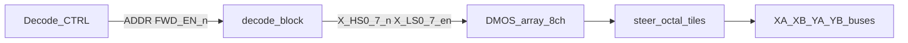

# Signal naming and hierarchical scale path

**Status:** `baseline` (Phase 0 contract)  
**Owns:** net grammar, naming layers, decode/DMOS call model  
**Does not own:** pin-budget tables — see [hierarchy_abi.md](hierarchy_abi.md); authority map: [AUTHORITY.md](AUTHORITY.md)

Physical connector contract: [design_specification.md](design_specification.md). Process and anti-explosion rules: [system_design_spec.md](system_design_spec.md).

**Rule:** the hierarchical sheet is a *function*; root wires are the *call arguments*. Define logic once; instantiate and scale with buses and layout replication.

## 1. Three naming layers

| Layer | What it is | Drive lines | Sense / fold |
|-------|------------|-------------|--------------|
| **Physical** | Stamped on the plane PCB | Contacts **1–64** on XA/XB/YA/YB | Y contacts **65**, **66** |
| **Syntax** | Nets / code / KiCad hierarchy | `XA0`…`XA63` (0-based); block tokens `N`/`n` | `YA65`…`YB66` — **outside** Drive/Decode sheet pins |
| **Semantic** | Function | Half-select matrix | READ pickup + inhibit fold — **not** drive lines |

Map: physical contact \(p\) ↔ logical index \(p-1\). Never invent drive net `XA64`. Never put 65/66 in the Drive/Decode pin chain.

## 2. Gate / enable nets (matrix control)

Format: `[N]_[func][n][dir]_[logic]`

| Token | Meaning | Valid values |
|-------|---------|--------------|
| `N` | Axis | `X`, `Y` |
| `func` | Hardware role | `HS` (high-side), `LS` (low-side) |
| `n` | Index | Line `0`…`63`, or decode bank `0`…`7` |
| `dir` | Drive direction | omit = FWD/READ; `r` = REV/WRITE |
| `logic` | Active level | `_n` = active-low; `_en` = active-high (always explicit) |

**Examples:** `X_HS0_n`, `X_LS0_en`, `X_HS0r_n`, `Y_HS3r_n`.

<a id="REQ-NAME-GATE"></a>
**REQ-NAME-GATE** — audit regex (gate nets; single home):

```text
^[XY]_(HS|LS)[0-9]{1,2}r?_(n|en)$
```

## 3. Plane drive nets

Format: `[N][end][n]`

| Token | Meaning | Values |
|-------|---------|--------|
| `N` | Axis | `X`, `Y` |
| `end` | Connector side | `A` (one end of the line), `B` (other end) |
| `n` | Logical line | `0`…`63` |

Examples: `XA0`, `XB0`, `YA17`, `YB63`. Physical contact number = \(n+1\).

## 4. Global and special nets

| Class | Nets |
|-------|------|
| Enables | `FWD_EN_n`, `REV_EN_n`, `INH_EN_n`, `DEC_EN` |
| Analog / power | `VDRIVE`, `CCS_X`, `CCS_Y`, `CCS_INH`, `SENSE_P`, `SENSE_N`, `AGND`, `+3V3`, `+5V` |
| Sense / fold (not Drive/Decode hierarchy) | `YA65`, `YB65`, `YA66`, `YB66`, `SENSE_FOLD` |

Fold model: two independent loops `YA65`↔`YA66` and `YB65`↔`YB66`. The plane does not join them. Schematic center-tap node is **`SENSE_FOLD`**: `YA66` tied to `YB65`, soft ground 10 kΩ→AGND. Outer ends: `YA65` / `YB66`. See [theory_of_operation.md](theory_of_operation.md).

## 5. Hierarchical block ABI (reusable sheets)

Parent nets use §2–§4. **Inside** reusable sheets, pins stay parameterized with **`N`** (axis) and **`n`** (bank or group).

### Decode Block — target `decode_block.kicad_sch`

One axis: 74AHC138 HS + 74AHC238 LS. Hierarchical pins:

| Pin | Role | Example parent (X FWD) |
|-----|------|------------------------|
| `ADDR_NH[2:0]` / `ADDR_NL[2:0]` | Bank address | `ADDR_XH*` / `ADDR_XL*` |
| `BANK_EN` / `DEC_EN` | Bank / chip enable | `FWD_EN_n` / `DEC_EN` |
| `N_HS{0..7}_n` | HS outs | `X_HS0_n` … `X_HS7_n` |
| `N_LS{0..7}_en` | LS outs | `X_LS0_en` … `X_LS7_en` |

`line# = 8·HS + LS` (logical 0…63). Control stays at bank level (8+8), never 64 line pins per axis.

### DMOS array block — target drive atom

One 8-channel Toshiba DMOS package (or a small sheet that wraps one): TBD62783 (HS sources) or TBD62083 (LS sinks). This replaces the old per-line TC4427 + discrete MOSFET `drive_block` as the **primary** ABI.

| Pin class | Role | Example parent |
|-----------|------|----------------|
| `N_HS{0..7}_n` or `N_LS{0..7}_en` | Logic inputs from decode | `X_HS0_n` … / `X_LS0_en` … |
| Switch nodes (group) | High-current outputs toward steer | `XHS{g}` / `XLS{k}` (naming frozen at L2) |
| `VDRIVE` / return | Rails | `VDRIVE`; parent binds axis CCS as needed |

SS14 steering diodes live in steer tiles ([hierarchy_abi.md](hierarchy_abi.md)), not inside decode.

### Decode CTRL — target `decode_ctrl` / `decode_ctrl_y`

Address and bank-enable headers. Hierarchical pins are the function; root labels are the arguments. One axis of address per sheet; enable headers exist once (not cloned per axis).

| Pin | Role | Example parent |
|-----|------|----------------|
| `ADDR_NH[2:0]` | HS address | `ADDR_XH*` / `ADDR_YH*` |
| `ADDR_NL[2:0]` | LS address | `ADDR_XL*` / `ADDR_YL*` |
| `BANK_EN` | Bank enable, pull-up inactive | `FWD_EN_n` |
| `DEC_EN` | Chip enable, pull-down off | `DEC_EN` |
| `REV_EN_n` | Reverse bank enable, pull-up inactive | `REV_EN_n` |

## 6. Hierarchy as function call / instance



1. **Define once** — `decode_block`, DMOS array sheets, `decode_ctrl` with `N`/`n` hierarchical pins.
2. **Instantiate on root** — four `decode_block` calls (X/Y × FWD/REV); DMOS arrays receive bank buses; steer octal tiles bind to plane buses. FWD sources one plane end and sinks the other; REV swaps ends.
3. **Scale with buses** — root uses KiCad buses such as `X_HS[0..7]_n`, `X_LS[0..7]_en`, and `XA[0..63]` so the top sheet stays thick vectors, not hundreds of stubs.
4. **PCB multiplier** — route one DMOS/steer tile cleanly, then **Replicate Layout** for the remaining groups. Hierarchy makes instance membership unambiguous for the plugin.

## 7. Scale roadmap (target)

Written as **target** for this rewrite—not as-built status.

| Step | Schematic | SPICE / SIL | PCB |
|------|-----------|-------------|-----|
| Near-term | 4× `decode_block`, DMOS 8-ch arrays, octal steer tiles (or temporary small-N fixture) | L0–L2 on 2×2; L3 ideal n×n | Single tile layout |
| Next | Buses on root; drop any monolithic steer experiment | PIO SIL on ideal plant | Replicate tiles |
| Later | Full generated fabric from AST | Bench-calibrated L0/L3 | Full layout |

Layer contracts: [system_design_spec.md](system_design_spec.md). Coverage: [coverage_matrix.md](coverage_matrix.md).

## 8. What never enters the Drive/Decode chain

`YA65`, `YB65`, `YA66`, `YB66`, and `SENSE_FOLD` are sense/fold only. They may appear as local labels on the magnetic sheet or as Sense/Inhibit hierarchical pins, but they are **not** drive switch nodes and are **not** decode outputs.
