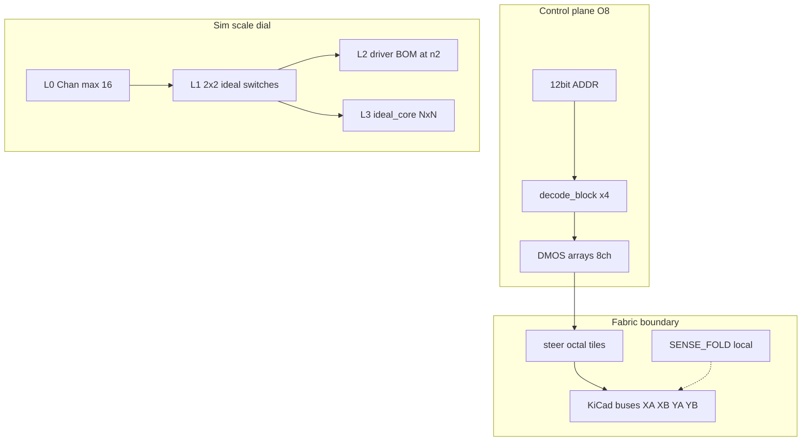

# Core Memory Driver & Digital Twin: System Design Specification

**Status:** `baseline` (Phase 0 contract)  
**Owns:** process, normative freeze table, L0–L4 gates, anti-explosion rules  
**Does not own:** plane ICD detail, timing prose, BOM tables, pin budgets — see [AUTHORITY.md](AUTHORITY.md)

Plane/timing ICD: [design_specification.md](design_specification.md). Net grammar: [naming.md](naming.md). Fabric pin budgets: [hierarchy_abi.md](hierarchy_abi.md).

## 1. Normative target architecture

**Normative target architecture** is the set of contracts that every generated schematic, SPICE plant, SIL plant, and future bench fixture **must** conform to before a fidelity layer may advance. It is the *intended* architecture for this rewrite, not an as-built report of any prior tree.

Anything that contradicts the left column below is a **doc bug** until formally revised. Open items stay listed; they are not silently frozen. Ownership of each row’s detail is in [AUTHORITY.md](AUTHORITY.md).

| Normative (frozen by Phase 0 / L2 ABI) | Non-normative (open until bench) |
|----------------------------------------|----------------------------------|
| Plane ICD: 64×64, 3-wire, XA/XB/YA/YB, physical 1–64 vs logical 0–63, Y65/66 sense | Exact \(I_c\) / \(I_c/2\) |
| Series fold `YA66`═`YB65`, outer ends `YA65`/`YB66`, soft mid-tap | Exact \(V_{drive}\) |
| Drive topology: AHC decode → TBD62783/TBD62083 → SS14 → CCS×3 | Inhibit polarity vs READ |
| Timing contract: READ → STROBE → INHIBIT → WRITE; RP2040 PIO requirement | Pico packaging, LED set, CCS MOSFET alternate |
| Naming layers + hierarchical ABI (bank-level control; sense outside Drive/Decode) | Parallel-loop sense alternative (deferred) |
| Fidelity ladder gates L0–L4 and coverage-before-scale rule | Implementation file paths until generators exist |

## 2. Architectural strategy & core principles

The architecture abandons monolithic, transient-heavy full-matrix SPICE in favor of a layered digital twin. Three artifact classes:

1. Physical physics model (single-core / small-N calibration)
2. Idealized array plant (logical coincidence at scale)
3. Hardware schematic fabric (generated CAD)

**Governing principles:**

* **Fidelity is a dial.** Simulation fidelity scales from nonlinear ODEs (single core) to \(O(1)\) behavioral logic (full matrix).
* **Unified AST (planned).** A single weave-geography AST will generate SPICE netlists, KiCad schematics, and SIL plants. Generators are not in this tree yet; until they are, contract docs are the baseline and geometry claims stay coverage-gated ([AUTHORITY.md](AUTHORITY.md) Layer D).
* **Manufacturing-aligned boundaries.** Hierarchical blocks match plane pinouts and scaling constraints; they do not expose 256 drive ends through decode/drive sheets.
* **Performance as a gate.** No simulation layer advances without a runtime budget.

## 3. ICD pointer (normative detail elsewhere)

All generated schematics and simulation plants must conform to the frozen plane interface, sense/inhibit fold, drive topology, and timing in **[design_specification.md](design_specification.md)**. Net grammar and decode/DMOS call model: **[naming.md](naming.md)**.

**Essentials (anti-explosion context only — do not edit ICD here):**

* The plane has **256** physical drive ends; that surface is real hardware and is **not** the default unit of sim fidelity or root-sheet pin budget.
* Control stays bank-level (8 HS + 8 LS); sense/fold nets stay outside Drive/Decode.
* Gate-net audit regex lives in [naming.md](naming.md) §2 (do not fork a second copy here).

## 4. Anti-explosion rules (normative)

**REQ-SCALE-ANTIX** — The plane’s 256 drive ends must never be the default unit of simulation fidelity, hierarchical pin budget, or root-sheet wiring.

1. **Control stays bank-level.** Decode exposes `N_HS{0..7}_n` / `N_LS{0..7}_en` (8+8), not 64 line pins per axis. Line select is \(line = 8 \cdot HS + LS\). Sense/fold nets never enter Drive/Decode pins.
2. **DMOS is the drive atom.** Hierarchical drive fabric is 8-channel array blocks (TBD62783 / TBD62083), not 256 discrete half-bridges and not per-line TC4427 blocks as the primary ABI. BOM detail: [component_selection.md](component_selection.md); ID **REQ-DRV-DMOS**.
3. **L0 never scales.** Chan / detailed physics: ≤16 instances; never the n=64 proof.
4. **L1/L2 prove the cycle at n=2.** Full WRITE/READ/INHIBIT and driver-BOM e2e stay on the 2×2 oracle; L2 freezes decode/drive ABI there.
5. **L3 is the only full-matrix sim path.** Behavioral `ideal_core` + line \(R/L/C\) + sparse/diagonal patterns; runtime in minutes. No 4,096 nonlinear cores.
6. **L4 fabric tiles the 256 ends.** Prefer octal steer tiles and root buses `XA[0..63]`…; forbid monolithic 320-pin steer + duplicated ~512 root stubs as the target ABI. Fold stays local on the magnetic sheet. Details: [hierarchy_abi.md](hierarchy_abi.md).
7. **Coverage before scale.** No n×n schematic/SIL claim without a [coverage_matrix.md](coverage_matrix.md) row.

## 5. The fidelity ladder

Aligned with project phases 1–5 in the root README (Phase 0 = doc/ICD freeze; Phase 6 = bench).

### Layer 0: Detailed physics (single core)

**GATE-L0-PHYSICS**

* **Implementation:** SPICE Chan model (`K` statement) parameterized for 50-mil cores (\(L_m \approx 0.00314\) m, \(A_c \approx 0.097\) µm², \(H_c \approx 150\) A/m). Parallel damping for ~1 µs peaking.
* **Gates:** Stable half-select hold, read-1 amplitude discrimination, restore polarity.
* **Constraint:** Calibration only. Never scale beyond 16 cores without a runtime budget check.

### Layer 1: Oracle array (2×2 matrix)

**GATE-L1-CYCLE**

* **Implementation:** SPICE transient deck with 4 `coremem` (or equivalent) instances, 3× ideal CCS sinks, and the `YA66`═`YB65` fold ([design_specification.md](design_specification.md) **REQ-ICD-FOLD**).
* **Gates:** Full WRITE/READ/INHIBIT cycle. Single-CCS failure deck remains a persistent regression.

### Layer 2: Driver fidelity & ABI lock

**GATE-L2-E2E**

Still at **n=2**. Substitutes ideal L1 switches with the finalized silicon BOM:

**74AHC138, 74AHC238, TBD62783, TBD62083, SS14, TLV3501** (plus Sense latch / CCS parts per [component_selection.md](component_selection.md) **REQ-DRV-DMOS**).

* **Gates:** Address-pin end-to-end cycle timing, strobe window (~150–300 ns), fail-safe pull-ups/downs, FWD/REV mutex.
* **Output:** Freezes schematic ABI (`decode_block` and DMOS drive-array block pinouts). Discrete TC4427A + FDS8958A is **not** the L2 BOM.

### Layer 3: Idealized \(N \times N\) & SIL

**GATE-L3-SIL**

* **Implementation:** Ideal behavioral core (threshold-law \(I_c\) flip, fixed sense pulse) + line impedance (\(R\), \(L\), line-to-ground \(C\)).
* **SIL:** Plant driven by synthetic PIO/decode stimuli (e.g. PySpice bridging to MCU firmware).
* **Gates:** Full diagonal and random sparse patterns; continuous runs finish in minutes.

### Layer 4: Hardware fabric generation

**GATE-L4-FABRIC**

* **Implementation (planned):** Unified AST Python generator emits KiCad schematics. Steer as octal (or equivalent) bus tiles; root uses plane buses—see [hierarchy_abi.md](hierarchy_abi.md).
* **Gates:** Clean ERC. Zero hand-edits on generated sheets; topological fixes flow from the AST script.

## 6. Generator pipeline & documentation

A single deterministic build pipeline is the planned geometry source of truth (`mce_array.py` or equivalent AST). Documentation is an active test surface: scale claims require a [coverage_matrix.md](coverage_matrix.md) row showing which surfaces (Schematic, SPICE, SIL, Bench) are validated at a given \(N \times N\). Hardware commitments must not outpace simulation capability.

## 7. Phase map (process)

| Phase | Focus | Doc / ladder home |
|-------|--------|-------------------|
| **0** | Resolve doc conflicts; freeze ICD + naming | [AUTHORITY.md](AUTHORITY.md); this doc §§1–4; [naming.md](naming.md); [design_specification.md](design_specification.md) |
| **1** | L0 single-core physics | §5 **GATE-L0-PHYSICS** |
| **2** | L1 2×2 oracle + CCS failure regression | §5 **GATE-L1-CYCLE** |
| **3** | L2 driver fidelity (DMOS BOM) + ABI freeze | §5 **GATE-L2-E2E** |
| **4** | L3 ideal \(N \times N\) SIL | §5 **GATE-L3-SIL** |
| **5** | L4 AST → KiCad (tiled fabric) | §5 **GATE-L4-FABRIC**; [hierarchy_abi.md](hierarchy_abi.md) |
| **6** | Bench bring-up (2×2 first), then scale | Open decisions in [design_choices.md](design_choices.md) |
