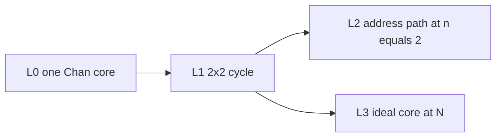
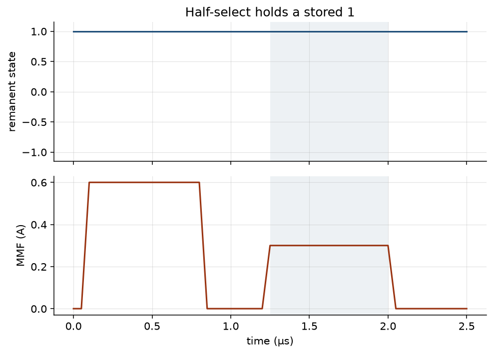
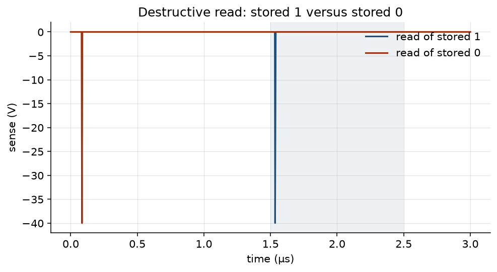
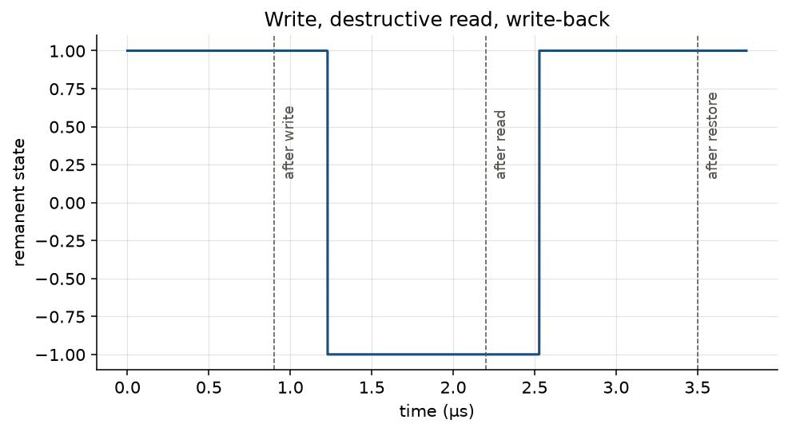
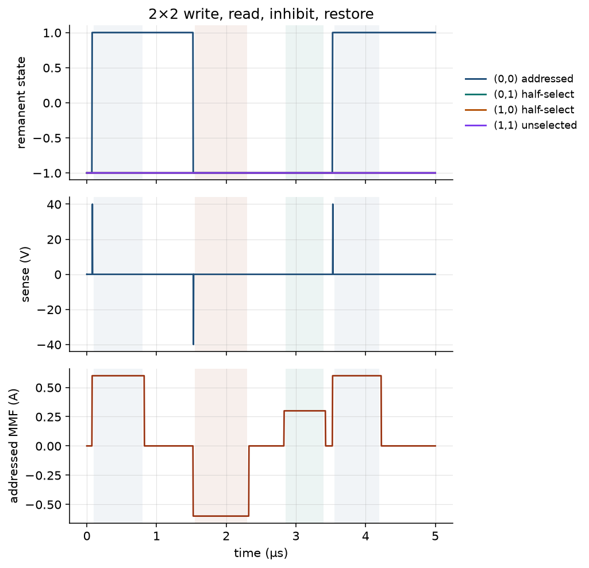
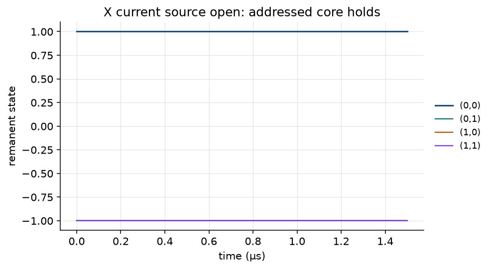
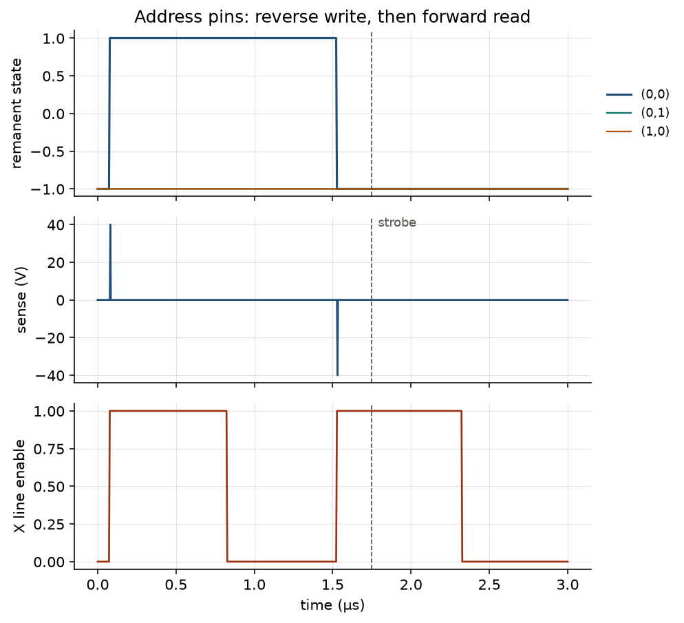
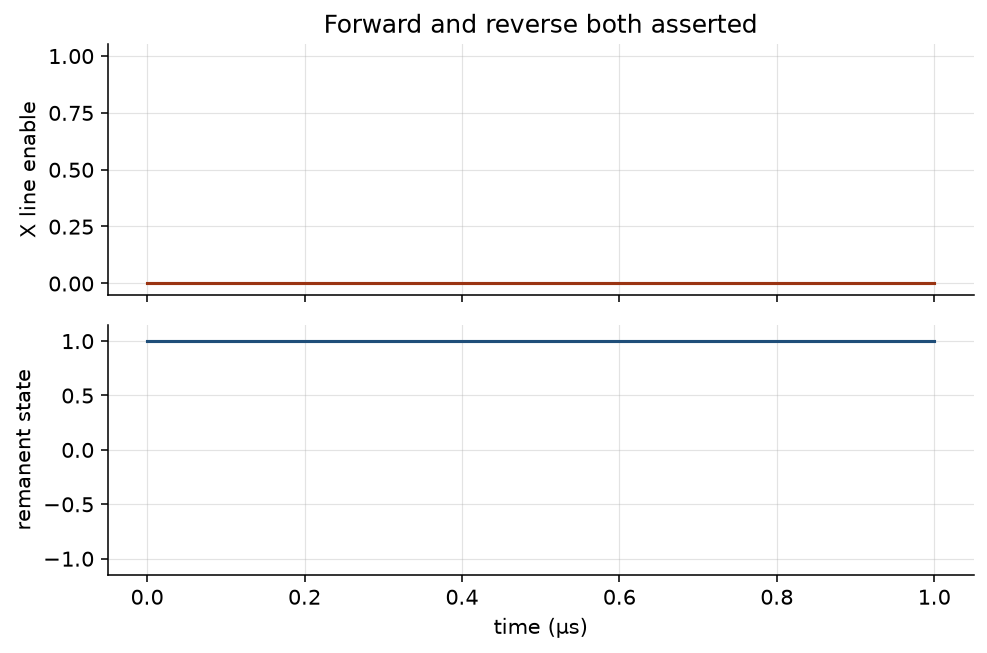
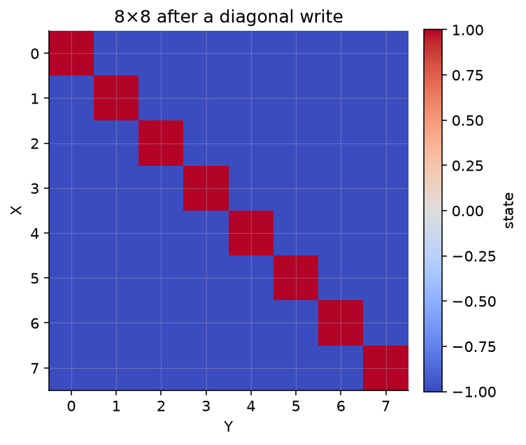
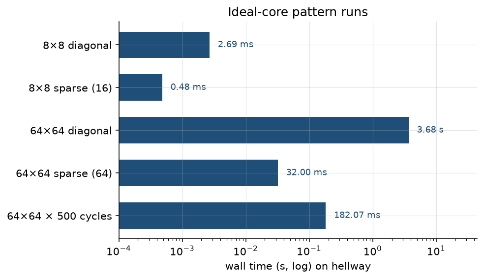

# A record of the driver, so far

This is a snapshot of a ground-up magnetic core memory driver and the digital twin that is being built beside it. The plane is a 64×64 ferrite array. The work is a rewrite, arranged so an agent can move against a frozen contract and a simulator. Three things count as done, when they are done: the process, the circuit, and the documentation of both. This essay is only the telling of where that stands on 4 October 2026.

The figures below were rendered that day on a machine named hellway, from the same stimuli the gate tests already run. The samples quoted in the text are in [figures/results.json](figures/results.json). Drive current in these decks is a simulation assumption, \(I_c = 600\,\mathrm{mA}\) so \(I_c/2 = 300\,\mathrm{mA}\). The exact operating current is still an open bench question; the owner for that list is [docs/design_choices.md](../docs/design_choices.md).

If a sentence here and an owner document disagree, the owner wins. This folder does not feed the design.

## The array, in one sitting

Each core sits at a crossing of an X wire and a Y wire. A full write or a destructive read wants about \(I_c\) through that one core. The driver puts \(I_c/2\) on one X line and \(I_c/2\) on one Y line. Only the intersection sees the full current. Every other core on those two lines is half-selected, and a half-selected core has to keep its bit.

The cores on this plane are three-wire. There is no separate inhibit winding. The sense wire does both jobs, at different times. During a read it is a millivolt pickup. During a write of zero it carries \(I_c/2\) in series, opposing the write so the selected core stays at zero. The plane folds that sense path outside the array: two loops joined by a jumper, so one comparator and one inhibit driver can see the whole weave. A read to one destroys a stored one, so every access is a read, then a write that puts the bit back, or writes the new one. The sense strobe has to land in a quiet window after the read edge and before the inhibit and write edges, on the order of 150–300 ns into the read.

That is the whole machine the rest of this record is trying to drive. The contract for the fold, the sense path, and the timing lives in [docs/design_specification.md](../docs/design_specification.md). A shorter teaching pass is [docs/theory_of_operation.md](../docs/theory_of_operation.md).

## Working with agents

The method is a box around the agent. Each kind of fact has one owner. Plane geometry, net names, the bill of materials, pin budgets, open decisions, and scale claims live in different files, and the map of who owns what is [docs/AUTHORITY.md](../docs/AUTHORITY.md). Downstream text links to the owner. It does not grow a second copy of the fold, the part numbers, or the gate criteria.

When two owners seem to conflict, the work stops and a person decides. Chat is a scratchpad. A scale claim is allowed to appear in one place, the coverage matrix, and only after a run has earned the cell. That is how an agent is kept from inventing a third architecture in the middle of a task: the next sentence has to land in a document that already has a job, or it does not land.

The practical shape of a task is therefore small. Read the map, open the owner for the fact at hand, change that fact or the simulation that checks it, and leave the other documents alone. The coverage matrix, as of this record, says a single core and the 2×2 driver path have passed in SPICE, and the ideal plant has passed at 8×8 and 64×64. Schematic sheets and a bench have no passing cell. Those sentences are the matrix’s, in [docs/coverage_matrix.md](../docs/coverage_matrix.md).

## Simulation in the loop

A nonlinear ferrite model of all 4,096 cores will not finish inside a loop an agent can wait on. The ladder answers one question at a time, on the smallest plant that can answer it.



L0 asks whether the physics we are willing to trust can hold a half-select, tell a stored one from a stored zero on a destructive read, and accept a write-back. It is one core, a Chan-threshold subcircuit, and it stays small: at most sixteen instances, and never the proof at n=64.

L1 asks whether four cores, wired as a 2×2 with the external sense fold, can run a full write, read, inhibit, and restore, and whether a failed current source on one axis leaves the addressed core alone. The switches here are ideal.

L2 asks the same cycle with the address pins in the path: decode, the forward and reverse banks, and the DMOS polarity the board will actually use. It still sits on the 2×2. It checks that both banks asserted together produce no drive, that an idle enable produces no drive, and that the strobe window still sees the destroyed bit while the bank is on.

L3 asks whether a whole matrix can be walked. The core there is a threshold law: full-select flips, half-select holds, a destructive read of a one emits a fixed sense pulse. Each line carries a lumped resistance, inductance, and capacitance, and the plant waits out that settle before it treats the bit as valid. Stimuli are a synthetic stand-in for the PIO sequence. Patterns are a full diagonal and a random sparse set, at 8 and at 64, plus a few hundred continuous cycles at 64. Chan stays behind, on L0.

L4, the tiled schematic fabric, and the bench bring-up are later. The rules for the ladder, and the reason the 256 drive ends are not the unit of simulation, are in [docs/system_design_spec.md](../docs/system_design_spec.md).

Each layer is a pytest module. A thin wrapper, `scripts/run_gate.py`, runs one gate by name. A green run is what turns a coverage cell from a plan into a pass. The essay does not add a new test. It replays the ones that already exist and draws them.

## What the runs show

### One core

The first question is half-select. Both axes carry 300 mA together, which is a full-select write, and the remanent state sits at +1. Then only one axis carries 300 mA. The magnetomotive force during that second pulse is 0.300 A, and the state afterward is still +1. The shaded band in the figure is that one-axis pulse.



The second question is whether a read can tell the bits apart. A stored one, read with both axes at −300 mA, produces a sense spike of 40.0 V inside the read window and leaves the state at −1. The same read of a stored zero, in that same window, produces a sense peak of \(4 \times 10^{-15}\,\mathrm{V}\), which is numerical zero. The early spike on the stored-zero trace is the write that put the zero there, starting from a stored one; the shaded band is the read, and that read is quiet.

The 40 V figure is the model’s sense node. A flux scale inside the Chan subcircuit sets the height of these numerical peaks. The gate asks for discrimination: the stored-one peak has to dwarf the stored-zero peak. It does. A bench measurement on the real plane will be millivolts, and this plot is not that measurement.



The third question is restore. The core is written to +1, read back through zero to −1, and written again to +1. Sampled after each phase, the state is +1, then −1, then +1.



### A 2×2 cycle

Four cores share the fold. The addressed core is (0,0). The run writes a one, reads it, drives the inhibit current through the sense path, and writes the one back.

After the write, (0,0) is at +1. The two half-selected neighbors, (0,1) and (1,0), stay at −1, and so does the unselected core; on the plot those three traces lie on top of each other. The read drives the addressed core to −1 and puts a 40.0 V spike on the sense node, same numerical sense scale as the single core. During inhibit the addressed magnetomotive force is 0.300 A, the half-current on the sense wire, and the core stays at the zero the read just wrote. The restore returns (0,0) to +1.

The bands on the figure are the four phases: write, read, inhibit, restore.



The regression that has to keep passing is a broken X source. Y is enabled, X is open, and the addressed core starts as a stored one. A single axis must not flip it. After the pulse, (0,0) is still at +1.



### The address path

L2 keeps the 2×2 and inserts the decode path in front of it. Address (0,0), a reverse-bank write, then a forward-bank read. After the write, (0,0) is +1 and the half-selected neighbors are still −1. After the read, (0,0) is −1. The sense spike on that read is 40.0 V, again the model node, sitting on the leading edge of the forward pulse.

The dashed line is the strobe, 1.75 µs, which is 200 ns after the read edge. At that instant the addressed state is already −1, and the X line enable is still 1. The bit is valid while the bank is still on. That is the window the timing contract is trying to protect.



The mutex is the fail-safe. Forward and reverse are both asserted, with decode enabled. The X line enable stays at 0, and a stored one on (0,0) is still +1 at the end of the run. An idle enable, covered by the same gate and not drawn here, does the same thing: no drive, core holds.



### The full matrix, idealized

L3 does not have a SPICE waveform to show. The plant applies settled currents after a lumped line delay, then updates a threshold core. The honest pictures are the array and the clock.

An 8×8 written with ones on the diagonal and zeros elsewhere holds exactly eight ones, on that diagonal. The same plant, the same write, is what runs at 64×64. The small map is the one a person can read.



Wall time on hellway, for the same workloads the gate runs:

| Run | Wall time |
|-----|----------:|
| 8×8 diagonal, every cell written and checked | 2.69 ms |
| 8×8 sparse, 16 cells, seed 42 | 0.48 ms |
| 64×64 diagonal, every cell written and checked | 3.68 s |
| 64×64 sparse, 64 cells, seed 7 | 32.0 ms |
| 64×64, 500 random cycles, seed 3 | 182 ms |

The long bar is the full diagonal at 64, because that walk touches all 4,096 cores twice: a write, then a read and restore. The 500-cycle run is a thin sample of the same plant, which is why it finishes faster than the exhaustive diagonal. All five finished well inside the gate’s two-minute budget. The axis is logarithmic so the millisecond runs stay visible next to the 3.68 s bar.



## The edge of the record

The tree this essay describes has the contracts, the L0–L2 SPICE decks, and the L3 ideal plant. KiCad sheets, a geometry generator, and firmware are later phases. The coverage matrix still has empty schematic cells and an empty bench column. Bring-up, when it happens, starts at 2×2.

Still open, and owned by the design-choices note rather than by this prose: the exact \(I_c\), the drive-rail voltage, inhibit polarity against the read, and how the RP2040 is packaged. The 600 mA used in every figure above is the harness assumption, recorded so the plots can be read, and it is not a frozen setpoint.

To draw the figures again:

```bash
uv run --group writeup python writeup/scripts/render_figures.py
```
